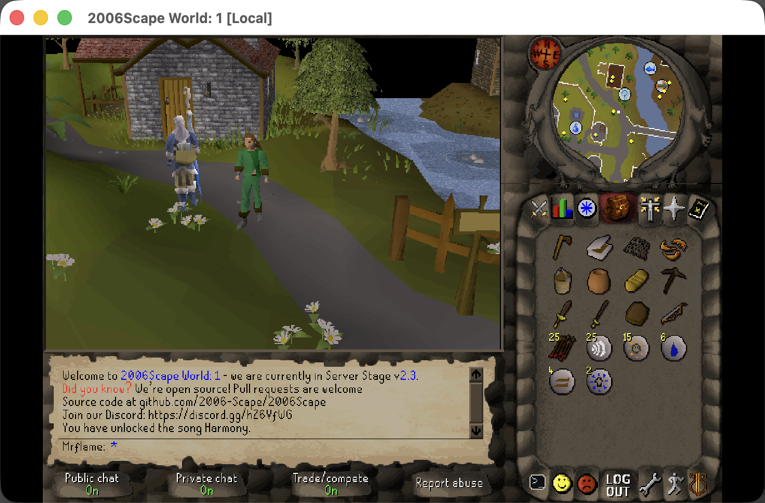
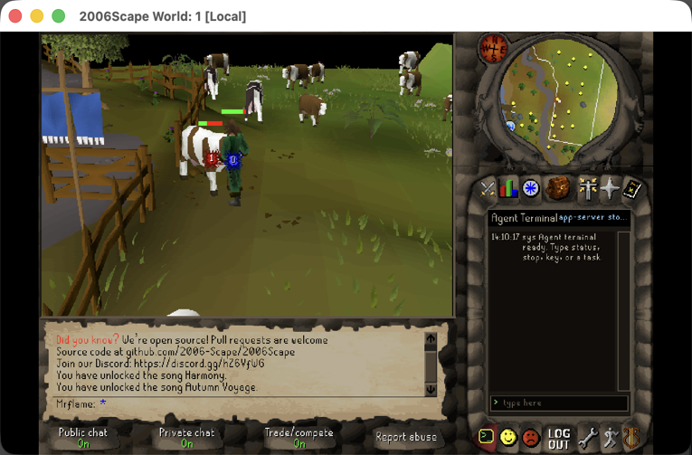
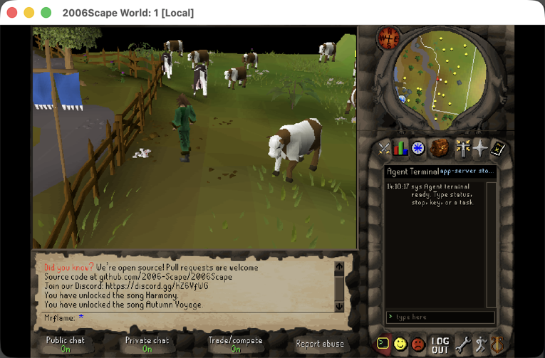
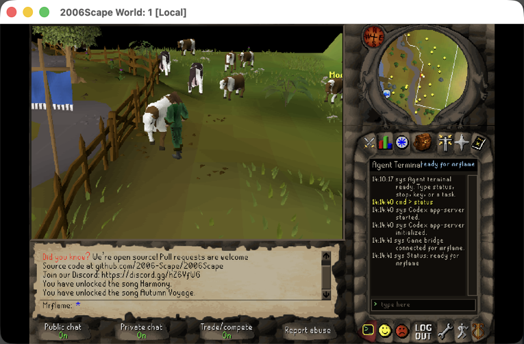

# 2006Scape - but with codex 


# About This Fork

This fork turns 2006Scape into a local, instrumented RuneScape agent laboratory. The original private server and desktop client are still here, but they now carry a Codex bridge that lets a logged-in player type `/agent ...` in the normal chatbox and hand a bounded gameplay task to an AI agent. The interesting part is the constraint: the agent plays through the server's own mechanics. It walks, clicks objects, opens gates, fights NPCs, eats food, banks, shops, mines, cooks, smiths, and waits for real ticks. It does not teleport, spawn items, edit stats, or drive the screen with brittle mouse automation.

The result is a fork that is part RSPS, part embodied-agent testbed. It has local route memory, compact game-state tools, profile-scoped sessions, primitive-backed Python runners, passive telemetry, screenshot evidence, and readable session reports. A run is not just "the bot did a thing"; it leaves behind enough structured evidence to explain how the agent chose a route, what the world did back, where it got stuck, and what the harness should learn next.

## Current Agent Demo

These screenshots were captured from this checkout on June 6, 2026 with the local client, server, and bridge running. The demonstration used a starter demo profile, dismissed the post-login welcome interface through the bridge, then ran one bounded `cowhide_combat_runner.py` cycle. The runner walked from Lumbridge toward the cow pen, enabled run, opened the cow-pen gate, attacked a cow, gained combat XP, picked up one cowhide, and stopped at its `max_cycles` boundary.

| Starting In Lumbridge | Fighting Through The Bridge | Result In The Cow Pen |
| --- | --- | --- |
|  |  |  |

The final compact checks showed the demo profile alive at `3254,3266,0`, HP `9/10`, run still enabled, one cowhide in inventory, and recent Attack and Hitpoints XP from the fight. That small run is representative of the fork's design: a high-level goal becomes server-authoritative primitives, and the proof is visible in both the game client and the generated route/combat evidence.

The in-client Agent Terminal is also live. In the same session, typing `/agent status` through the Java client opened the side-panel terminal, started and initialized the Codex app-server path, connected the game bridge, and reported readiness for the selected profile.



## What Makes It Different

- **The client can summon Codex from inside the game.** `/agent key`, `/agent status`, `/agent stop`, and `/agent <task>` live in the normal chat flow. The Java client launches `codex app-server --listen stdio://`, exposes dynamic `rs` tools, and keeps the player-facing experience inside the 2006Scape window.
- **The server owns the truth.** The bridge runs on `127.0.0.1:43610`, scopes each session token to the logged-in player that claimed it, and queues gameplay work through `AgentActionService` so actions drain on normal server ticks. HTTP handlers do not mutate player state directly.
- **The tool surface is compact enough for long runs.** Full observation exists for debugging, but normal agent loops use XS and XXS tools such as `observe_state_XS`, `observe_state_XXS`, `walk_to_tile_until_arrived_XS`, `wait_until_idle_XXS`, `wait_until_combat_event_smart_XXS`, `deposit_inventory_items_XS`, `withdraw_bank_items_XS`, and `bank_item_count_XS`. Those tools return the survival, inventory, movement, XP, and decision fields an agent needs without flooding the model with the whole world.
- **Strategy lives outside Java.** The Java bridge provides reusable primitives: observe, walk, interact with objects/NPCs, use item on item/object, click interface buttons, select interface items, attack, eat, pick up drops, bury bones, bank, shop, and wait. Python runners compose those primitives into mining, woodcutting, fletching, food, smithing, combat, agility, crafting, route, and banking workflows.
- **Routes are learned artifacts, not hidden behavior.** `agent-navigation/` stores places, hazards, route definitions, movement traces, object-transition evidence, screenshots, route tests, and helper scripts. ML2 route definitions are the preferred normal A-to-B route contract, while older route runners remain as diagnostics.
- **Profiles are isolated.** The legacy default profile remains supported, and named profiles use their own bridge session files, client pid files, logs, route trace filters, screenshots, runner status files, and sparse character memories.
- **Every serious run can become evidence.** Agent sessions write raw JSONL events and readable Markdown summaries under `2006Scape Server/data/logs/agent-sessions/`. Passive movement telemetry records active players without model polling. Screenshot helpers capture compact client-window proof when live geometry or UI state matters.

## Agent Capabilities

The current bridge and harness can support:

- compact state observation, profile memory hints, HP/food/run/combat checks, recent XP deltas, nearby NPC/object/ground-item context, and bank/item count queries;
- safe movement through tiles, path steps, landmarks, route definitions, run-energy policy, and object transitions such as gates, doors, ladders, stairs, and trapdoors;
- combat loops with style selection, target choice, HP thresholds, eating, combat-event waits, selected looting, bone burial, and banking/restock policy;
- skilling loops for mining, woodcutting, fletching, fishing, cooking, firemaking, smithing, crafting, agility, and food production through primitive-backed scripts;
- economy actions such as opening shops, buying/selling items, banking resources, preserving food counts, trimming coin floats, and checking exact bank quantities without a full observation dump;
- route and map tooling, including passive movement traces, cache-backed map rendering, active movement/fog/heat maps, route risk checks, and failure summaries;
- reusable script discovery through `agent-navigation/tools/script_registry.py`, so an agent can search for `combat`, `mining`, `food`, `smithing`, `route`, or other workflows before guessing filenames.

The most important design rule is that new gameplay automation should prefer these primitives and scripts before adding another Java strategy tool. Java is the control surface; Python and JSON own route choice, trip policy, recovery, banking strategy, and long-running skill logic.

## Safety And Boundaries

This fork deliberately avoids the shortcuts that would make the demo less interesting. Agent actions should stay server-authoritative and use existing mechanics such as walking, `ClickObject`, `CombatAssistant.attackNpc`, normal skill handlers, bank/shop handlers, dialogue buttons, and inventory interactions. Do not add admin teleports, item spawning, direct player-state edits, raw token logging, or screen automation for gameplay.

Bridge sessions are local and scoped. The client claims a server-side session with a one-time nonce, the repo wrappers read only ignored session files under `agent-navigation/.local/`, and secrets must not be printed, committed, or copied into logs. The generated traces, screenshots, runner logs, and local character files are ignored unless a specific artifact is intentionally curated, as the demo images above were.

For a contributor-oriented inventory of fork work, see [canvrno's additions so far](docs/canvrno-additions.md). For the runtime flow that starts the server, launches a profile-aware client, claims the bridge, and verifies compact tools without printing tokens, see [Local Agent Startup](docs/local-agent-startup.md). For the route and runner harness, start with [agent-navigation/README.md](agent-navigation/README.md) and [Agent Scripting Primitives](agent-navigation/scripting-primitives.md).

For external-player experiments, start with [External Deployment Quickstart](docs/external-deployment-quickstart.md), [Deployment Networking](docs/deployment-networking.md), [Player Agent Mode](docs/player-agent-mode/README.md), and [Agent Bridge Gateway](docs/agent-bridge-gateway.md). The packaged desktop client defaults to `client.scale=2` and `show_navbar=false`, using the client-owned scale path instead of JVM UI scaling so the larger window keeps normal in-game mouse coordinates. Keep the raw agent bridge on loopback only; remote `/agent` use should go through an operator HTTPS `/agent` gateway packaged as `agent.bridge.url`, or through a trusted private tunnel for local/dev fallback.

## External Deployment Quick Reference

For the recommended turnkey encrypted private path, use Tailscale: copy `2006Scape Server/ServerConfig.Tailscale.Sample.json` to the ignored runtime config, replace `REPLACE_WITH_TAILSCALE_IP` and `example-tailnet-host`, keep `secure_external_transport_confirmed=true`, and grant players only the game/cache ports through the tailnet. Prepared Tailscale bundles include `server-deployment/tailscale-policy-grants.example.json` as a least-privilege starting point and deliberately omit the agent bridge port. For the simplest no-install public-player test, use `direct_tcp`: copy `2006Scape Server/ServerConfig.External.Sample.json`, replace `REPLACE_WITH_PUBLIC_INTERFACE_IP` and `server.example.com`, set `direct_tcp_external_transport_confirmed=true`, and acknowledge that this is plaintext TCP. `Server startup rejects external-player configs unless PBKDF2 account auth` is enabled with account auto-create and legacy auth disabled. For an encrypted public client tunnel without a VPN, start from `ServerConfig.ClientTlsTunnel.Sample.json`; packages include `client-tls-tunnel/stunnel-client.conf`, and operator-side templates use `client_tls_tunnel_server_accept_host` plus `--client-tls-tunnel-dir` with real non-placeholder hosts and `--tls-sni-host` only for the real certificate hostname. Use `scripts/prepare-external-deployment.py --require-encrypted-external` or `CLIENT_REQUIRE_ENCRYPTED_EXTERNAL=1 scripts/package-client.sh` when producing a player package that must not fall back to plaintext `direct_tcp`. Browser play is documented as future research, not the external-player MVP.

Account and package checks are source-side guardrails. Use `scripts/account-admin.py --require-password-policy audit`; `scripts/create-account.py` rejects passwords shorter than 12 characters unless explicitly overridden, and account records carry `passwordPolicy`. `scripts/package-client.sh` refuses symlinked output directories, records `source_server_config_sha256`, writes login guidance to use the server operator's supplied account, warns players not to reuse passwords, and ships macOS double-click .command wrappers. `scripts/prepare-external-deployment.py` also emits `server-deployment/player-handoff-template.md`. After the bundle exists, `scripts/provision-player-account.py PLAYER --character CHARACTER --prepared-dir dist/external-deployment` creates the ignored PBKDF2 account record, audits it, writes the generated password only to an owner-only ignored credentials env file, and renders a public-safe player handoff note without printing the password. Then `scripts/package-player-kit.py PLAYER --character CHARACTER --prepared-dir dist/external-deployment` creates and self-verifies the public-safe zip to send with the client archive, handoff note, and checksums while excluding passwords, account records, secrets, private credentials, runtime backups, bridge tokens, claim nonces, API keys, and Discord bot tokens. Run `scripts/verify-player-kit.py --kit dist/external-deployment/player-kit-PLAYER.zip --prepared-dir dist/external-deployment --username PLAYER --character CHARACTER` before distribution to re-check the copied zip, embedded checksums, and absence of private runtime data. Use `scripts/render-player-handoff.py --prepared-dir dist/external-deployment --username PLAYER --character CHARACTER` when the account already exists and only the note is needed, without accepting or printing the password. The macOS/Linux setup checker can start the bundled stunnel config temporarily for `client_tls_tunnel` no-login diagnostics.

Live proof is separate from source validation. Use `scripts/probe-deployment-network.py`, `scripts/probe-concurrent-logins.py`, `--live-login-username`, `--live-local-login-username`, `--live-local-host` on loopback, `--live-reject-login-username`, `--live-reject-login-expected-statuses 3,4` for final readiness so the accepted rejection codes are pinned, and focused `--expect-statuses` rejection probes when needed. Discord proof uses `--live-discord`; Direct player chatbox delivery proof is required through `agent_chat_player_delivery` and `--agent-chat-delivery-log-text MARKER --agent-chat-delivery-log-to-name PLAYER`. Expected readiness states include `LIVE_PROOF_PARTIAL_NEEDS_...`, `LIVE_NETWORK_AUTH_CLIENT_CHAT_BACKUP_PROOF_RECORDED_DISCORD_NOT_REQUESTED`, and `FULL_LIVE_NETWORK_AUTH_CLIENT_CHAT_BACKUP_AND_DISCORD_PROOF_RECORDED`.

For final evidence, prefer `deployment-proof-manifest.json` with `--proof-manifest`, `--update-proof-manifest`, `--json-output`, and `scripts/deployment-readiness-status.py --prepared-dir dist/external-deployment --show-next-commands`. Use `scripts/write-desktop-client-proof.py` with a non-symlink screenshot/log evidence file, `scripts/backup-runtime-data.py` for an owner-only archive, `proof-templates/runtime-data-backup-proof.md`, and `scripts/check-deployment-proof-manifest.py` before `scripts/package-deployment-proof.py --prepared-dir dist/external-deployment` for the final external-ready handoff. The proof bundle includes non-secret metadata such as `server-deployment/player-handoff-template.md` and excludes runtime backups, character saves, account records, secrets, passwords, bridge tokens, and Discord tokens. Final-gate manifests must keep `require_full_proof:true` and `require_encrypted_external:true`; `prepare-external-deployment.py --require-full-proof` runs the merged manifest plus CLI values before package/build work begins. Runtime backup validation rejects symlinked proof notes, checks `backup archive sha256`, and requires a no runtime start/stop/restart proof line plus create the proof manifest parent directory.

Structured coordination chat is available from the game with `::agentchat @agent:Name message`, `::agentchat @player:Name message`, or channel forms, and from scripts with `agent-navigation/tools/agent_chat_XS.py --profile`. Target shortcuts are mutually exclusive. Use these for coordination, not as a public chat replacement or a hot-loop polling primitive.

## Usage Quickstart

There are two good ways to drive the agent.

**In the game client:** use this when you want the 2006Scape window to be the main control surface.

```sh
./scripts/run-local.sh -u "ExampleAgent"
```

Then log in and type commands in chat:

```text
/agent status
/agent travel to Lumbridge cows
/agent kill one cow and pick up the cowhide
/agent mine copper and tin, then bank the ores
/agent stop
```

If `/agent status` says Codex needs a key, run `/agent key` and enter the API key in the Swing password dialog. The key is passed to Codex auth and is not written into repository files. Once the terminal says the app-server and game bridge are ready, ordinary `/agent <task>` commands become Codex turns with read-only filesystem policy, no network access at turn time, and dynamic `rs` tools scoped to the logged-in player.

**From the repo harness:** use this when you want reproducible local automation, screenshots, route evidence, and compact wrapper commands.

```sh
JAVA_BIN=/opt/homebrew/opt/openjdk/bin/java \
  python3 agent-navigation/tools/runtime_doctor.py claim --profile ExampleAgent --verify

agent-navigation/tools/observe_XXS.sh
agent-navigation/tools/observe_XS.sh
python3 agent-navigation/tools/script_registry.py search combat
```

For another profile, pass `--profile PROFILE` or set `RS_PROFILE=PROFILE`. The helper writes only ignored session files under `agent-navigation/.local/`, and the wrapper scripts read those files without printing bridge tokens.

## Sample Workflows

**Check readiness and player state**

```sh
python3 agent-navigation/tools/runtime_doctor.py status --profile ExampleAgent --observe
agent-navigation/tools/observe_XXS.sh
agent-navigation/tools/observe_XS.sh
agent-navigation/tools/rs-tool_XS.sh bank_item_count '{"names":["Cowhide","Coal","Iron ore"]}'
```

Use XXS for heartbeat checks such as tile, HP, food, combat, death, and run state. Use XS when the next decision needs compact inventory, bank, equipment, nearby object/NPC, route, or skill context.

**Run a bounded early-combat trip**

```sh
python3 agent-navigation/tools/cowhide_combat_runner.py \
  --profile ExampleAgent \
  --max-cycles 1 \
  --no-final-bank \
  --no-buy-kebabs \
  --quiet
```

That is the workflow used for the screenshots above. It routes to the Lumbridge cow pen, handles the gate, attacks through combat primitives, watches HP/XP/drop state, picks up cowhide, and stops at a safe boundary.

**Route somewhere with the current ML2 route contract**

```sh
agent-navigation/tools/observe_XS.sh
python3 agent-navigation/ml2-routing/route_ml_XS.py define \
  --from 3254,3266,0 \
  --to lumbridge_bank \
  --combat-level 3 \
  --food 2 \
  --run-energy 80 \
  --run-enabled
```

If the returned route definition includes an execution command, run that command exactly when live movement is intended. The route definition is the contract: it captures the decision, safety notes, route steps, object transitions, and execution path.

**Mine and bank resources**

```sh
python3 agent-navigation/tools/script_registry.py search mining
python3 agent-navigation/tools/mining_runner.py --list-sites --ores copper,tin,iron
python3 agent-navigation/tools/mining_runner.py --ores iron --max-loads 1 --quiet
python3 agent-navigation/tools/mining_runner.py --target-mining-level 20 --auto-buy-bronze-pickaxe
```

The mining runner chooses live rocks from cache-backed site data, routes between mines and banks, mines through object primitives, waits for real idle/completion states, and records generated evidence under ignored local run folders.

**Fish, cook, and bank food**

```sh
python3 agent-navigation/tools/script_registry.py search food
python3 agent-navigation/tools/food_bank_XS.py
python3 agent-navigation/tools/food_runner.py --mode fish-cook --quiet
python3 agent-navigation/tools/catherby_food_runner.py --cycles 1 --quiet
```

The Catherby runner is a larger example of script-side strategy: it moves among shore, range, bank, and shop targets, opens known doors, chooses fish methods by both Fishing and Cooking requirements, drops burnt food, and banks useful output.

**Smelt or smith through interface primitives**

```sh
python3 agent-navigation/tools/script_registry.py search smithing
python3 agent-navigation/tools/smithing_runner.py --mode smelt --bar bronze --quiet
python3 agent-navigation/tools/smithing_runner.py --mode smith --item sword --amount 10
```

Smithing uses ordinary furnace/anvil/object interactions, interface button clicks, item selection, and `wait_until_idle` rather than a one-off Java strategy shortcut.

**Capture visual evidence**

```sh
agent-navigation/tools/capture-client-screenshot.sh --prefix route-proof --native-size
agent-navigation/tools/capture-cardinal-screenshots.sh --prefix gate-debug
```

Use screenshots when the live client view matters: wrong side of a gate, a door state, a staircase, a wall pocket, an unexpected combat situation, or a README-quality demo. Generated captures under `agent-navigation/screenshots/` are ignored by default; copy only curated images into `docs/images/` when they belong in documentation.

**Inspect session and runner evidence**

```sh
python3 agent-navigation/tools/agent_session_XS.py --profile ExampleAgent --latest
python3 agent-navigation/tools/runner_status_XS.py --profile ExampleAgent
python3 agent-navigation/tools/route_failure_XS.py --profile ExampleAgent
```

These compact readers are meant for the agent loop. They summarize current status, last route outcome, blockers, and recent session usage without dumping full raw JSONL into the model context.

# Installation + Running (Developers)

## One-command local launch on macOS

From the repository root:

```sh
./scripts/run-local.sh
```

This builds both Maven modules, starts the server from `2006Scape Server`, waits for the local game port, and launches the client with `-local -s localhost`. Closing the client stops the background server process started by the script.

The server uses `2006Scape Server/ServerConfig.json` when it exists, otherwise it falls back to `2006Scape Server/ServerConfig.Sample.json`. To use a specific config:

```sh
SERVER_CONFIG="2006Scape Server/ServerConfig.Sample.json" ./scripts/run-local.sh
```

Useful focused scripts:

```sh
./scripts/build-local.sh
./scripts/start-server.sh
./scripts/start-client.sh
```

`start-server.sh` copies the built server jar to `/tmp/2006scape-run/` before launching it. Keep that behavior on during local work: do not run the live server directly from `2006Scape Server/target/server-1.0-jar-with-dependencies.jar` while rebuilding with Maven, because replacing a jar under a running Java 8 process can crash lazy class loading.

Launcher JVM options can be passed through environment variables:

```sh
SERVER_JAVA_OPTS="-Dsun.zip.disableMemoryMapping=true" ./scripts/start-server.sh
CLIENT_JAVA_OPTS="-Dsun.java2d.uiScale=2" ./scripts/start-client.sh -u "ExampleAgent"
CLIENT_SINGLE_INSTANCE=0 ./scripts/start-client.sh -u "SecondAgent"
```

The client also supports a repo-native scale flag that doubles the game canvas while preserving normal in-game mouse coordinates:

```sh
./scripts/start-client.sh -u "ExampleAgent" -scale 2 -no-nav
```

On macOS, use `Command+Shift+N` or `File > New Client Window` from a running packaged client to open another client without copying login credentials or agent claim state. The current and new windows tile automatically: the second client uses the other half of the display, and third/fourth clients use quadrants. You can also request tiling directly at launch:

```sh
./scripts/start-client.sh -scale 1 -no-nav -tile 1/2
CLIENT_SINGLE_INSTANCE=0 ./scripts/start-client.sh -scale 1 -no-nav -tile 2/2
```

Client arguments can be appended to either client launcher, for example:

```sh
./scripts/run-local.sh -u myname -p mypass
```

For current agent testing, prefill a local profile, or choose another profile explicitly:

```sh
./scripts/run-local.sh -u "ExampleAgent"
./scripts/run-local.sh -u "SecondAgent"
```

For Codex-controlled exploration where repo tools such as `agent-navigation/tools/rs-tool.sh` need an active bridge session, use the dedicated startup runbook:

- [Local Agent Startup](docs/local-agent-startup.md)

## Using the Codex Agent Bridge

Prerequisites:

- Build and run both modules locally.
- Start the client with `-local`, `-dev`, or `-offline` so it connects to localhost and disables CRC checking.
- Log into a local account before using `/agent`.
- Have the Codex CLI/app-server available on your `PATH`; the client launches `codex app-server --listen stdio://` when an agent session starts.

Basic flow:

1. Start the local server and client:

   ```sh
   ./scripts/run-local.sh -u "ExampleAgent"
   ```

   For another profile, use that profile name and set `RS_PROFILE=<name>` for repo-side bridge tools.

2. Log into the game world.
3. Type `/agent key` once per local setup and enter your API key in the Swing password dialog. The key is passed to Codex auth and is not written to repository files.
4. Type `/agent status` to confirm the app-server, auth, and session state.
5. Type a task, for example:

   ```text
   /agent travel to varrock east bank
   /agent mine iron ore and bank it
   /agent smelt bronze bars
   /agent train combat safely toward 50 attack strength and defence
   /agent buy kebabs, bank extra coins, then train on a safe nearby target
   ```

6. Use `/agent stop` to interrupt the active turn and clear the current server-side action.

Agent sessions are local gameplay runs. The model is expected to observe first, prefer server-side batch tools for repeated travel and resource gathering, use `wait_until_idle` for production batches such as smelting or smithing, and adapt to game state such as missing tools, low hitpoints, full inventory, unreachable targets, closed interfaces, or insufficient skill levels.

Current navigation work is tracked in `agent-navigation/`. That folder stores places, route memories, hazards, route tests, and live observations. The most recent focus is safe travel, including run-energy requirements around south Varrock and the verified Varrock square to Champions' Guild stairs route.

To discover repo helper scripts without knowing exact filenames, use the lightweight registry:

```sh
python3 agent-navigation/tools/script_registry.py search "route*"
python3 agent-navigation/tools/script_registry.py show agility --json
```

Useful checks while developing the bridge:

```sh
mvn -q clean test
mvn -q -DskipTests package
```

1. Import Project in IntelliJ

2. Hit File > Project Settings > Set SDK to Java 8 (Download [Java 8 SDK](https://adoptopenjdk.net/?variant=openjdk8) if you don't have one already)

3. Navigate to `2006Scape Server` > `src` > `main` > `java` > `com.rs2`, right click GameEngine and hit Run [Image](https://i.imgur.com/HHooeVu.png)

   [(You Can Also Run The Server With The -c/-config Argument)](https://wiki.2006scape.org/books/getting-setup/page/server-arguments)
5. Navigate to `2006Scape Client` > `src` > `main` > `java`, right click Client and hit Run [Image](https://i.imgur.com/gSmqGLn.png)

*Advanced*

To compile any module from the command line, run `mvn clean install`

## Using Parabot with your local server:
- **1:** Download the latest Parabot Client from [here](https://github.com/2006-Scape/Parabot/releases)
- **2:** Run the parabot client with the following arg:
```fix
java -jar Parabot.jar -local
```
- **3:** ???
- **4:** PROFIT

### Server source layout

- `2006Scape Server` contains all the server code; mark `src` as the Sources directory
- `2006Scape Client` contains all the client code; likewise mark `src`
  - If more than 2 arguments are passed in (can be anything), the client runs locally

## Building from command line

Run `mvn -B clean install`
